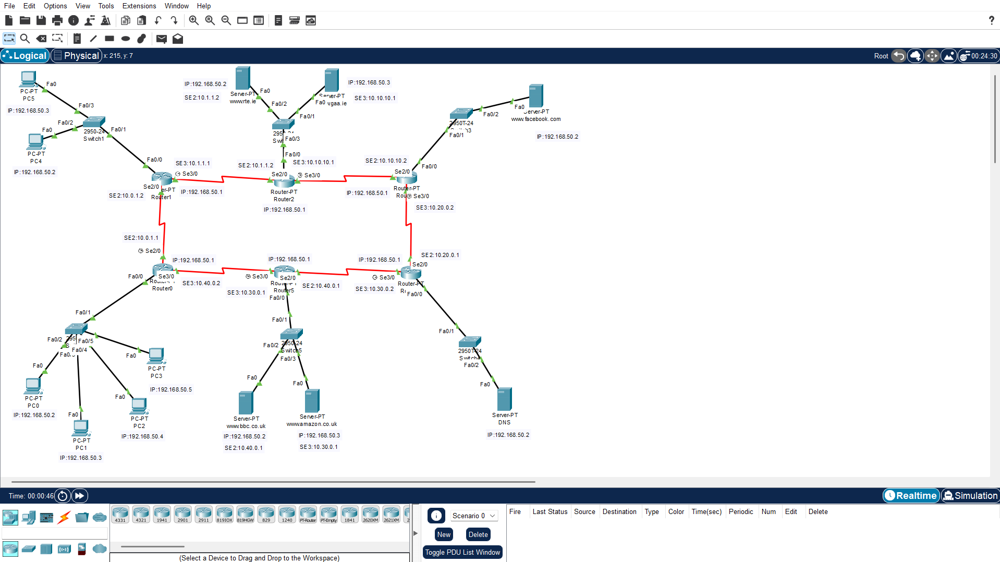
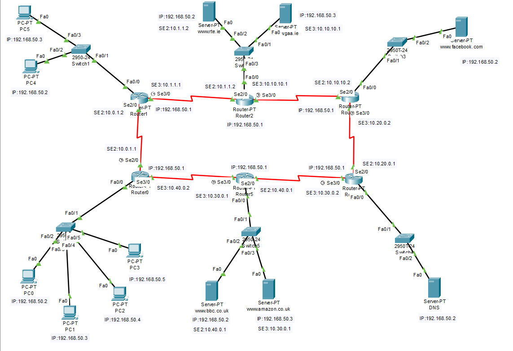

# ATU Network Technologies Project 2025

## Overview

This repository contains my Cisco Packet Tracer project completed as part of the **Network Technologies module** at Atlantic Technological University (ATU).

> A simulated enterprise network built in Cisco Packet Tracer featuring multi-router routing, NAT, DNS, and web services. The network simulates real-world communication between multiple LANs and public-facing servers.

---

## Key Features

- Multi-router topology with interconnected LANs  
- RIP configured on all routers for dynamic routing  
- NAT implemented to allow internal devices to access external servers  
- DNS server configured to resolve domain names (e.g. websites)  
- Multiple web servers with customised `index.html` pages  
- Full connectivity: all PCs can successfully access all web servers  

---

## Technologies Used

- Cisco Packet Tracer
- IPv4 Addressing & Subnetting
- **RIP (Routing Information Protocol)**
- **NAT (Static/Dynamic mapping of private to public IPs)**
- **DNS Configuration**
- Web Server Configuration (HTTP)
- Router & Switch Configuration (CLI)

---

## Network Topology

### Full Network Overview

*Figure 1: Complete network topology in Cisco*

### Alternative View / Detailed Layout

*Figure 2: Router-level topology view*

---

## How to Run

1. Open Cisco Packet Tracer  
2. Load the `robertnolan.pka` file  
3. Use **Simulation Mode** to observe packet flow  
4. Test connectivity:
   - Use `ping` between devices  
   - Access web servers via browser using configured domain names  

---

## Testing & Validation

- Verified connectivity using `ping` across all networks  
- Confirmed DNS resolution for all configured domains  
- Tested NAT functionality for external access  
- Accessed each web server via browser to confirm correct page display  

---

## Skills Demonstrated

- Network design and topology planning  
- IP addressing and subnetting  
- Dynamic routing configuration (RIP)  
- NAT implementation (static and dynamic)  
- DNS and web server configuration  
- Network troubleshooting and validation  

---

## Project Requirements

- Build the network topology as specified
- Label all devices with:
  - Device name
  - Port/interface
  - IP address (for PCs and routers)
- Apply appropriate subnetting
- Configure public IP addressing for servers
- Implement DNS services
- Configure NAT (Network Address Translation)
- Enable routing between all networks
- Ensure all PCs can access all web servers

---

## Project Structure

- `robertnolan.pka` file – Main Cisco Packet Tracer project file  
- `README.md` – Project documentation  

---

## Learning Outcomes

Through this project, I developed practical skills in:

- Designing scalable network topologies  
- Configuring dynamic routing using RIP  
- Implementing NAT for real-world networking scenarios  
- Setting up DNS and web services  
- Troubleshooting connectivity and configuration issues  

---

## Author

- Robert Nolan  
- ATU Student – Network Technologies  

---

## Disclaimer
This project was created for academic purposes as part of coursework.